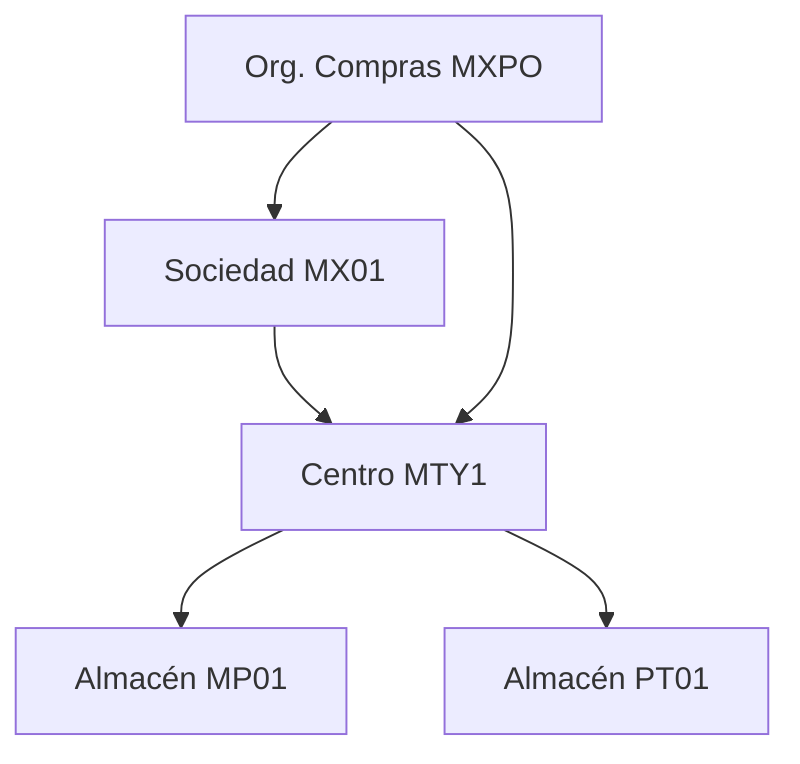

# Lab 01: Estructura organizativa MM

**Objetivo:** crear (o revisar en un sistema con datos de ejemplo) la estructura de una planta manufacturera y entender cómo se conecta con FI.

**Escenario:** empresa `MX01 – Manufacturas del Norte`, planta en Monterrey, dos almacenes (materia prima y producto terminado), una organización de compras central.

## Pasos (SPRO → Enterprise Structure)

| # | Objeto | Ruta / Transacción | Valor ejemplo |
|---|---|---|---|
| 1 | Sociedad (FI) | SPRO › Enterprise Structure › Definition › Financial Accounting › Edit Company Code (`OX02`) | MX01 |
| 2 | Centro (Planta) | Definition › Logistics-General › Define Plant (`OX10`) | MTY1 |
| 3 | Almacén | Definition › Materials Management › Maintain Storage Location (`OX09`) | MP01 (materia prima), PT01 (producto terminado) |
| 4 | Org. de compras | Definition › Materials Management › Maintain Purchasing Organization (`OX08`) | MXPO |
| 5 | Grupo de compras | SPRO › MM › Purchasing › Create Purchasing Groups | 001 Materia prima |
| 6 | Asignar centro → sociedad | Assignment › Logistics-General › Assign plant to company code (`OX18`) | MTY1 → MX01 |
| 7 | Asignar org. compras → sociedad | Assignment › MM › Assign purchasing org to company code (`OX01`) | MXPO → MX01 |
| 8 | Asignar org. compras → centro | Assignment › MM › Assign purchasing org to plant (`OX17`) | MXPO → MTY1 |
| 9 | Nivel de valoración | SPRO › Enterprise Structure › Definition › Logistics-General › Define valuation level (`OX14`) | Centro (lo estándar) |

## Preguntas para entrevista (contestar en el journal)

1. ¿Qué diferencia hay entre una org. de compras central, una a nivel sociedad y una a nivel centro?
2. ¿Por qué casi siempre se valora a nivel centro?
3. ¿Qué pasa en FI cuando un centro está asignado a una sociedad?

## Evidencia

- [ ] Capturas en `portfolio/lab-01/`
- [ ] Diagrama de la estructura (draw.io o Mermaid)

